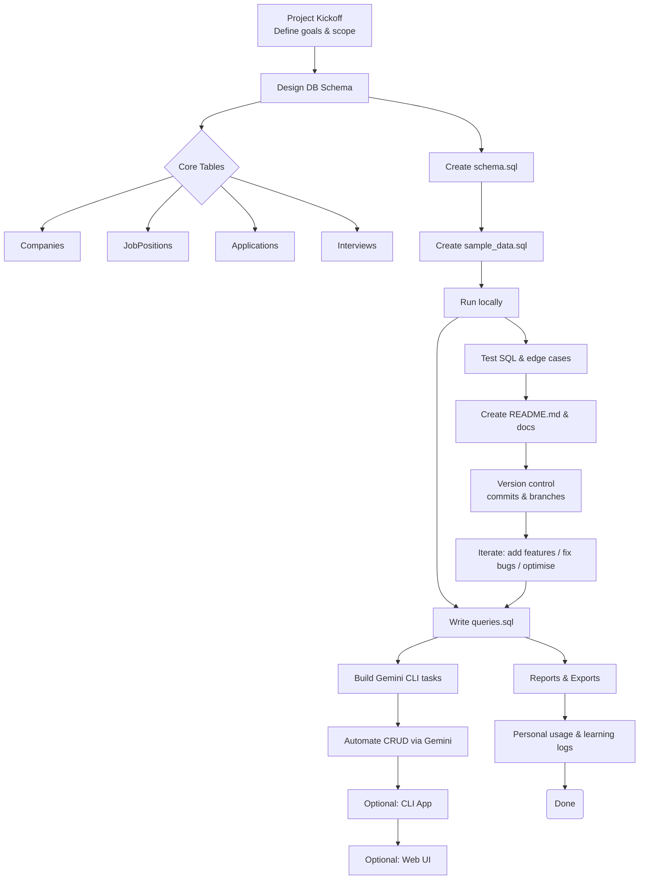

# WorkFlow

```mermaid
%% Job Application Tracker — high-level workflow
%% Confidence: High
flowchart TD

  %% Planning
  A[Project Kickoff\nDefine goals & scope] --> B[Design DB Schema]
  B --> C{Core Tables}
  C --> C1[Companies]
  C --> C2[JobPositions]
  C --> C3[Applications]
        %%(optional)
  C --> C4[Interviews]
  %% Implementation
        %%(CREATE TABLE scripts)
  B --> D[Create schema.sql]
        %%(INSERT sample rows)
  D --> E[Create sample_data.sql]
        %%(init DB)
  E --> F[Run locally]

  %% Practice & Features
        %%(SELECT / JOIN / AGGREGATES)
  F --> G[Write queries.sql]
        %%(.gemini prompts/scripts)
  G --> H[Build Gemini CLI tasks]
        %%(create/insert/update/delete)
  H --> I[Automate CRUD via Gemini]

  %% Interface & Extensions
        %%(enhance with prompts)
  I --> J[Optional: CLI App]
        %%(simple CRUD pages / export CSV)
  J --> K[Optional: Web UI]

  %% Testing & Docs
  F --> L[Test SQL & edge cases]
  L --> M[Create README.md & docs]
        %% (git)
  M --> N[Version control\ncommits & branches]

  %% Workflow loop
  N --> O[Iterate: add features / fix bugs / optimise]
  O --> G

  %% Helpful outputs
        %%(CSV, summary queries)
  G --> P[Reports & Exports]
  P --> Q[Personal usage & learning logs]

  %% End
  Q --> Z(Done)
```
